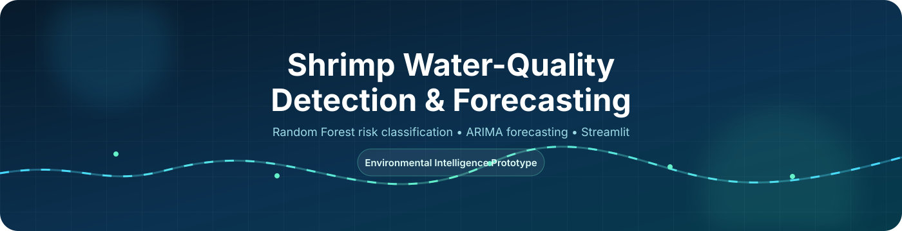
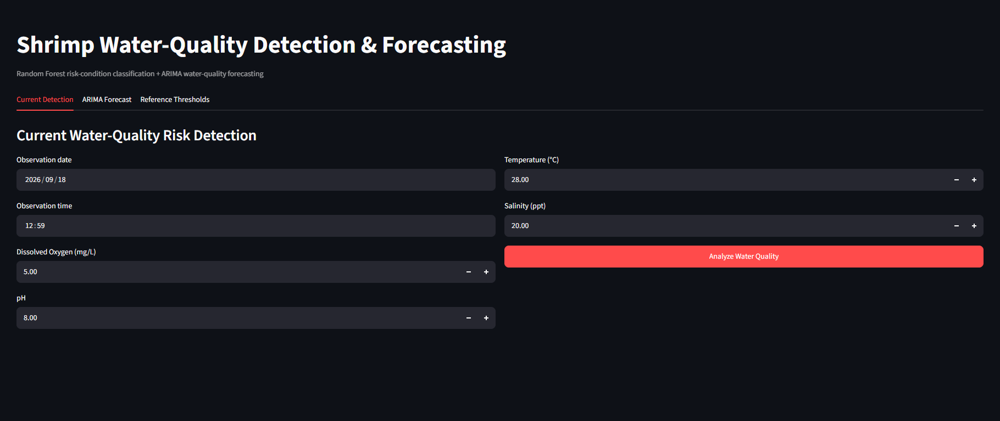

<div align="center">



<br>

# Shrimp Water-Quality Detection and Forecasting Model

### Environmental Risk Detection and Time-Series Forecasting for *Penaeus vannamei*

<p>
  
  
  
  
  
</p>

<p>
  
  
  
  
  
</p>

<br>

<a href="https://forecasting-mortality-prediction-for-penaeus-vannamei.streamlit.app/">
  
</a>
&nbsp;
<a href="https://github.com/itsy-Wency/Mortality-Prediction-for-Penaeus-vannamei">
  
</a>

<br><br>


</div>

---

## Project Overview

This project implements a **water-quality detection and short-term forecasting prototype** for *Penaeus vannamei* aquaculture.

It combines a Random Forest classification model with parameter-specific ARIMA forecasting models and exposes the trained models through a Streamlit web application.

### Core Capabilities

| Component | Function | Result |
|---|---|---|
| Random Forest | Environmental risk-condition classification | Low / Moderate / High Risk |
| ARIMA | Short-term water-quality forecasting | Future DO, pH, temperature, salinity |
| Threshold Engine | Parameter condition interpretation | Healthy / Conditional / Unhealthy |
| Streamlit | Interactive simulation interface | Browser-based model demonstration |

---

## Live Application

<div align="center">

<a href="https://forecasting-mortality-prediction-for-penaeus-vannamei.streamlit.app/">
  
</a>

<br><br>

<strong>https://forecasting-mortality-prediction-for-penaeus-vannamei.streamlit.app/</strong>

</div>

---

## Application Preview

<div align="center">



<br>

<sub>Interactive water-quality detection and forecasting interface.</sub>

</div>

---

## Model Architecture

```mermaid
flowchart LR
    A["Water-quality measurements"] --> B["Preprocessing"]

    B --> C["Random Forest"]
    B --> D["ARIMA Models"]

    C --> E["Environmental risk classification"]
    E --> F["Low / Moderate / High"]

    D --> G["DO forecast"]
    D --> H["pH forecast"]
    D --> I["Temperature forecast"]
    D --> J["Salinity forecast"]

    G --> K["Threshold evaluation"]
    H --> K
    I --> K
    J --> K

    K --> L["Projected environmental risk"]
```



---

## Water-Quality Thresholds

| Parameter | Healthy | Conditional | Unhealthy |
|---|---|---|---|
| **Dissolved Oxygen** | ≥ 5.0 mg/L | 3.7–4.9 mg/L | < 3.7 mg/L |
| **pH** | 7.5–8.5 | 6.5–7.4 / 8.6–9.0 | < 6.5 / > 9.0 |
| **Temperature** | 26–30 °C | 25–25.9 / 30.1–31 °C | < 25 / > 31 °C |
| **Salinity** | 15–25 ppt | 10–14.9 / 25.1–30 ppt | < 10 / > 30 ppt |

### Composite Risk Scoring

```text
Healthy      = 0 points
Conditional  = 1 point
Unhealthy    = 2 points

0–1 points   → Low Risk
2–3 points   → Moderate Risk
4+ points    → High Risk
```

---

## Machine Learning Pipeline

```text
Historical water-quality dataset
              |
              v
        Data preparation
              |
        +-----+-----+
        |           |
        v           v
 Random Forest    ARIMA
        |           |
        v           v
 Current risk    Forecasts
        |           |
        +-----+-----+
              |
              v
      Threshold evaluation
              |
              v
   Environmental interpretation
```

---

## Project Structure

```text
Mortality-Prediction-for-Penaeus-vannamei/
│
├── assets/
│   ├── animated-banner.svg
│   └── preview.png
│
├── outputs/
│   ├── arima_models/
│   │   ├── arima_DO_mg_L.joblib
│   │   ├── arima_pH.joblib
│   │   ├── arima_Salinity_ppt.joblib
│   │   └── arima_Temp_OC.joblib
│   │
│   ├── random_forest_risk_model.joblib
│   ├── arima_validation_metrics.csv
│   └── water_quality_forecast_and_projected_risk.csv
│
├── app.py
├── requirements.txt
├── requirements_shrimp_ml.txt
├── MLDATASET - cleaned.xlsx
├── shrimp_water_quality_detection_forecasting.ipynb
├── shrimp_water_quality_detection_forecasting_executed.ipynb
├── README.md
└── LICENSE
```

---

## Local Setup

### 1. Clone the repository

```bash
git clone https://github.com/itsy-Wency/Mortality-Prediction-for-Penaeus-vannamei.git
cd Mortality-Prediction-for-Penaeus-vannamei
```

### 2. Create the virtual environment

Windows PowerShell:

```powershell
python -m venv .venv
.venv\Scripts\activate
```

### 3. Install application dependencies

```powershell
python -m pip install -r requirements.txt
```

For notebook and model development:

```powershell
python -m pip install -r requirements_shrimp_ml.txt
```

### 4. Run the Streamlit application

```powershell
streamlit run app.py
```

The application will normally be available at:

```text
http://localhost:8501
```

---

## Notebook Workflow

Open the main notebook in VS Code:

```text
shrimp_water_quality_detection_forecasting.ipynb
```

Select the project virtual environment as the Python kernel and execute the notebook from top to bottom.

The notebook trains and exports the model artifacts used by the Streamlit application.

---

## Model Artifacts

The deployed application loads serialized models using Joblib:

```text
outputs/
├── random_forest_risk_model.joblib
└── arima_models/
    ├── arima_DO_mg_L.joblib
    ├── arima_pH.joblib
    ├── arima_Salinity_ppt.joblib
    └── arima_Temp_OC.joblib
```

Using serialized models allows the web application to perform inference without retraining the models each time the application starts.

For reproducibility, keep the Python and model-library versions compatible with the environment used during training.

---

## Forecast Evaluation

The ARIMA workflow evaluates forecasts using:

- **MAE** — Mean Absolute Error
- **RMSE** — Root Mean Squared Error

Generated evaluation files include:

```text
outputs/arima_validation_metrics.csv
outputs/water_quality_forecast_and_projected_risk.csv
```

---

## Demonstration Scenarios

### Baseline Healthy Condition

```text
DO          = 5.0 mg/L
pH          = 8.0
Temperature = 28 °C
Salinity    = 20 ppt
```

### High-Stress Simulation

```text
DO          = 2.0 mg/L
pH          = 6.0
Temperature = 33 °C
Salinity    = 35 ppt
```

These values are intended for **application demonstration and model simulation**, not as biological treatment recommendations.

---

## Research Scope and Limitation

The current dataset does not contain verified observed shrimp mortality/event labels.

Consequently, the Random Forest output should be interpreted as an:

> **Environmental risk-condition classification**

rather than a validated biological shrimp-mortality prediction.

The system should not be presented as:

- a validated shrimp mortality predictor;
- a guaranteed mortality warning system;
- a replacement for aquaculture expert assessment; or
- a validated production decision-support system.

A validated mortality prediction model would require appropriately labeled historical mortality/event data and independent biological validation.

---

## Research Interpretation

The overall research workflow combines:

```text
Water-quality monitoring
        +
Environmental threshold interpretation
        +
Random Forest classification
        +
ARIMA time-series forecasting
        =
Environmental risk-condition intelligence
```

The system is intended to demonstrate how machine-learning classification and time-series forecasting can be integrated into an interactive aquaculture monitoring prototype.

---

## License

This project is distributed under the MIT License.

See [`LICENSE`](LICENSE) for details.

---

<div align="center">

<a href="https://forecasting-mortality-prediction-for-penaeus-vannamei.streamlit.app/">
  
</a>

<br><br>

<sub>Research prototype for water-quality detection and forecasting in <i>Penaeus vannamei</i> aquaculture.</sub>

</div>
